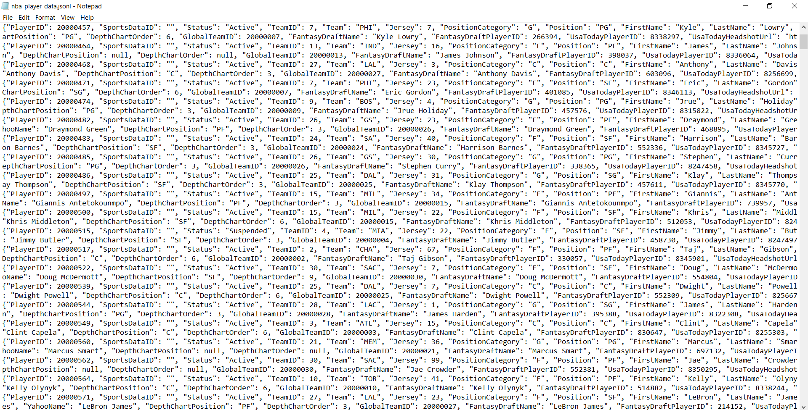
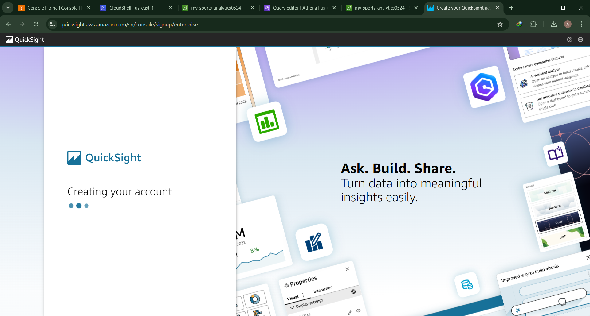
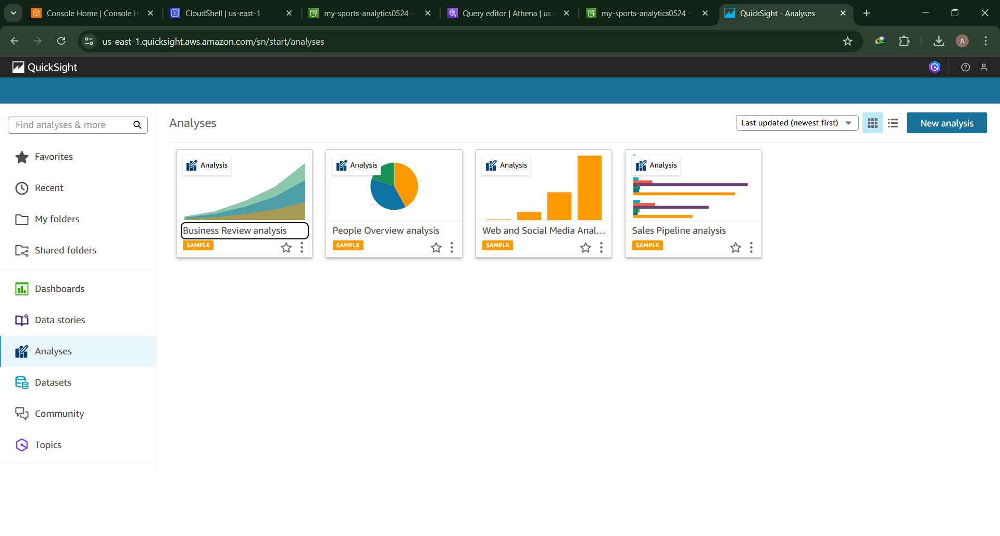
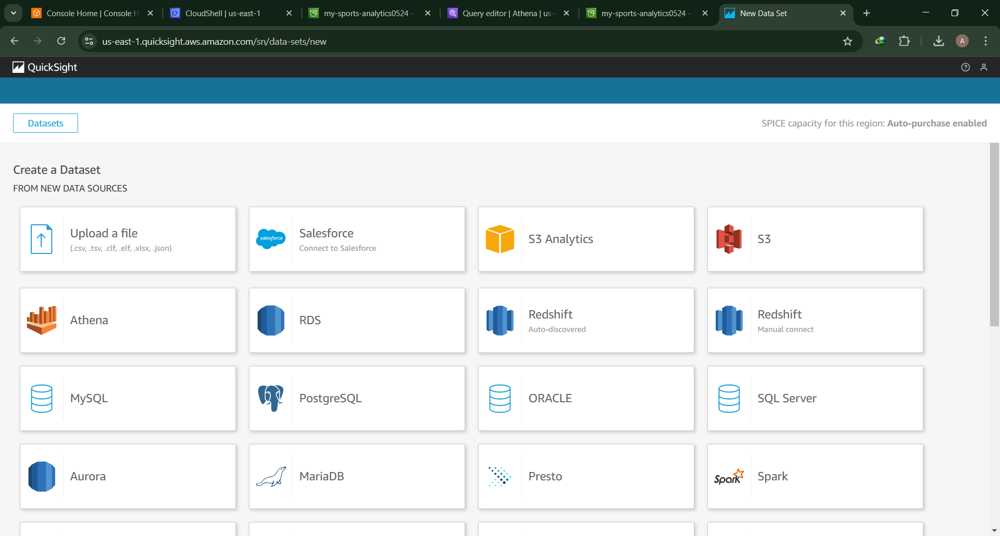
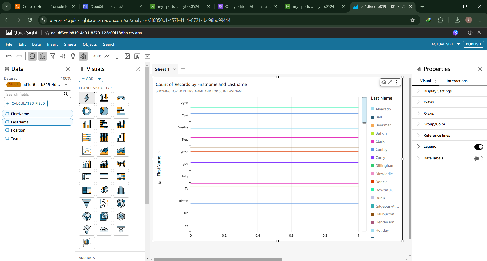
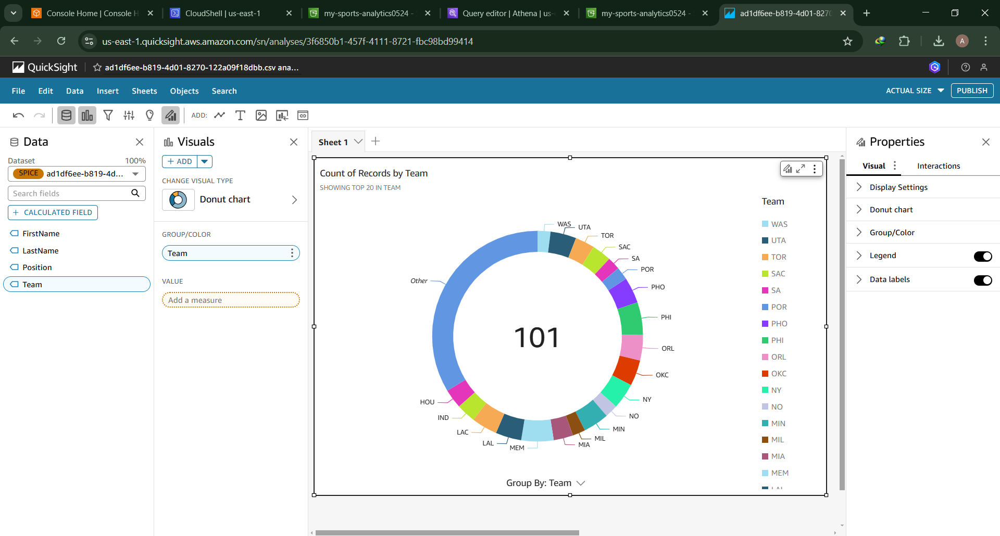

# NBA Data Lake Project

## Overview
This project sets up a data lake for NBA sports analytics using AWS services. It automates data ingestion, transformation, and visualization to provide advanced analytics and insights.

## Features
1. **Automate data ingestion with AWS Lambda**
2. **Implement a data transformation layer with AWS Glue ETL**
3. **Add advanced analytics and visualizations with AWS QuickSight**

## Prerequisites
- **AWS Account**: You need an AWS account to use AWS services.
- **AWS CLI**: Install and configure the AWS CLI.
- **Python 3.x**: Ensure you have Python 3.x installed.
- **pip**: Python package installer.
- **Virtual Environment**: (Optional) Create a virtual environment for the project.
- **Sportsdata.io API Key**: Sign up for an API key from Sportsdata.io.

## Setup Instructions

# Step 1: Open CloudShell Console

1. Go to aws.amazon.com & sign into your account

2. In the top, next to the search bar you will see a square with a >_ inside, click this to open the CloudShell
 
# Step 2: Create the setup_nba_data_lake.py file
1. In the CLI (Command Line Interface), type
```bash
nano setup_nba_data_lake.py
```

1. In another window, go to [GitHub](https://github.com/alahl1/NBADataLake)

-Copy the contents inside the setup_nba_data_lake.py file

-Go back to the Cloudshell window and paste the contents inside the file.


3. Press ^X to exit, press Y to save the file, press enter to confirm the file name 


# Step 3: Create .env file
1. In the CLI (Command Line Interface), type
```bash
nano .env
```
2. paste the following line of code into your file, ensure you swap out with your API key
```bash
SPORTS_DATA_API_KEY=your_sportsdata_api_key
NBA_ENDPOINT=https://api.sportsdata.io/v3/nba/scores/json/Players
```

3. Press ^X to exit, press Y to save the file, press enter to confirm the file name 


# Step 4: Run the script
1. In the CLI type
```bash
python3 setup_nba_data_lake.py
``` 

-You should see the resources were successfully created, the sample data was uploaded successfully and the Data Lake Setup Completed

# Step 5: Manually Check For The Resources
1. In the Search Bar, type S3 and click blue hyper link name

-You should see 2 General purpose bucket named "Sports-analytics-data-lake"

-When you click the bucket name you will see 3 objects are in the bucket


2. Click on raw-data and you will see it contains "nba_player_data.json"


3. Click the file name and at the top you will see the option to Open the file

-You'll see a long string of various NBA data


4. Head over to Amazon Athena and you could paste the following sample query:
   
   

5. You will need to locate the Data source and Catalogs > choose create data source abd select S3 AWS Glue - Catalog
   

6. Scroll down and click on create AWS Glue
   

7. Select the database in the letf conner to glue_nba_data_lake and paste the following 
```bash
SELECT FirstName, LastName, Position, Team
FROM nba_players
WHERE Position = 'PG';
```

   


-Click Run
-You should see an output if you scroll down under "Query Results"


Download this as a csv file we will be needing it soon.

# Now for advanced analytics and visualizations (AWS QuickSight)
1. Head to AWS QuickSight and create and account 


2. Click on Dataset by the left
   

3. Click on upload a file and upload that csv file we downloaded today, you remember right let's go 
   

4. Now lets visualize what we have uploaded using any visual type
      
      
    

5. Cleaning Up Resources     
   Go to the profile by the top right and click on Account Settings 
   

 6. Next clik on the toggle button that states account termination protection and off it 
     
7. Next we will delete the AWS resources 
 Still in the folder you will find the delete_aws_resources.py file there copy all the content and create a new file in the cloud shell and run the python file 

 ```
 nano delete_aws_resources.py
```
Save and exit 
```
python3 delete_aws_resources.py
```


### **What We Learned**
1. Securing AWS services with least privilege IAM policies:
I learned how to create and apply IAM policies that grant only the necessary permissions to AWS services and users. This practice enhances the security of my cloud infrastructure by minimizing the potential impact of compromised credentials and ensuring that each service and user has only the access they need.

2. Automating the creation of services with a script:
I discovered how to use scripts to automate the setup and configuration of AWS services. This automation reduces manual effort, ensures consistency across deployments, and speeds up the provisioning process. By scripting the creation of resources, I can easily replicate environments and make infrastructure changes more efficiently.

3. Integrating external APIs into cloud-based workflows:
I integrated data from external APIs, such as Sportsdata.io, into my AWS-based workflows. This integration allows me to enrich my data lake with real-time sports data, providing more comprehensive and up-to-date analytics. I learned how to handle API requests, process the data, and store it in a scalable and efficient manner.

4. Using AWS Glue for data transformation:
I learned how to use AWS Glue to create ETL (Extract, Transform, Load) jobs that transform raw data into a structured format suitable for analysis. This involved setting up Glue crawlers to catalog data and writing transformation scripts to clean and organize the data.

5. Querying data with Amazon Athena:
I explored how to use Amazon Athena to run SQL queries on data stored in S3. This serverless query service allows me to analyze large datasets quickly without the need for complex data warehousing solutions.

6. Creating visualizations with AWS QuickSight:
I learned how to use AWS QuickSight to create interactive dashboards and visualizations. By connecting QuickSight to my data sources, I can build visual representations of my data that provide valuable insights and support data-driven decision-making.


